# DataShare
## Application de partage de fichiers

Projet 3 — Expert DevOps OpenClassrooms
*Pilotez le développement d'une solution informatique*

---

# Sommaire

1. Contexte fonctionnel
2. Choix technologiques
3. Architecture (front, back, API, BDD)
4. Démonstration de l'application
5. Documentation
6. Pilotage et usage de l'IA

---

# 1. Contexte fonctionnel

## Le besoin

- Permettre à un utilisateur de **déposer un fichier** et d'obtenir un **lien de partage**
- Le fichier peut être protégé par un **mot de passe**
- Le fichier a une **date d'expiration** (1 à 7 jours)
- L'upload est possible **avec ou sans compte**

---

# 1. Contexte fonctionnel

## Fonctionnalités principales

- Inscription / connexion (compte utilisateur)
- Dépôt d'un fichier (anonyme ou connecté)
- Téléchargement via un lien public, avec mot de passe si besoin
- "Mon espace" : liste, tags et suppression des fichiers de l'utilisateur
- Accessibilité : mode contraste élevé, navigation au clavier

---

# 2. Choix technologiques

## Vue d'ensemble de la stack

| Couche | Technologie | Alternatives écartées |
|---|---|---|
| Frontend | React 19 + TypeScript + Vite | Vue, Angular |
| Backend | Symfony 8 (PHP 8.4) | Node.js, Java |
| Base de données | PostgreSQL 16 | MongoDB |
| Stockage fichiers | Disque local | S3 |

---

# 2. Choix technologiques

## Pourquoi Symfony ?

- Framework très structuré → facile à reprendre par un autre développeur
- Sécurité et authentification intégrées
- Migrations de base de données versionnées (Doctrine)
- Large communauté PHP en France

## Pourquoi React ?

- Très répandu, soutenu par Meta
- Composants réutilisables
- TypeScript = moins d'erreurs, code plus fiable

---

# 2. Choix technologiques

## Pourquoi PostgreSQL ?

- Les données (utilisateurs, fichiers, tags) sont **liées entre elles**
- PostgreSQL gère bien ces relations et garantit la cohérence des données

## Pourquoi stocker les fichiers sur disque ?

- Simple, gratuit, rapide en local
- Adapté à la taille du projet (MVP)
- Limite assumée : pas idéal si plusieurs serveurs en parallèle (→ S3 à terme)

---

# 3. Architecture générale

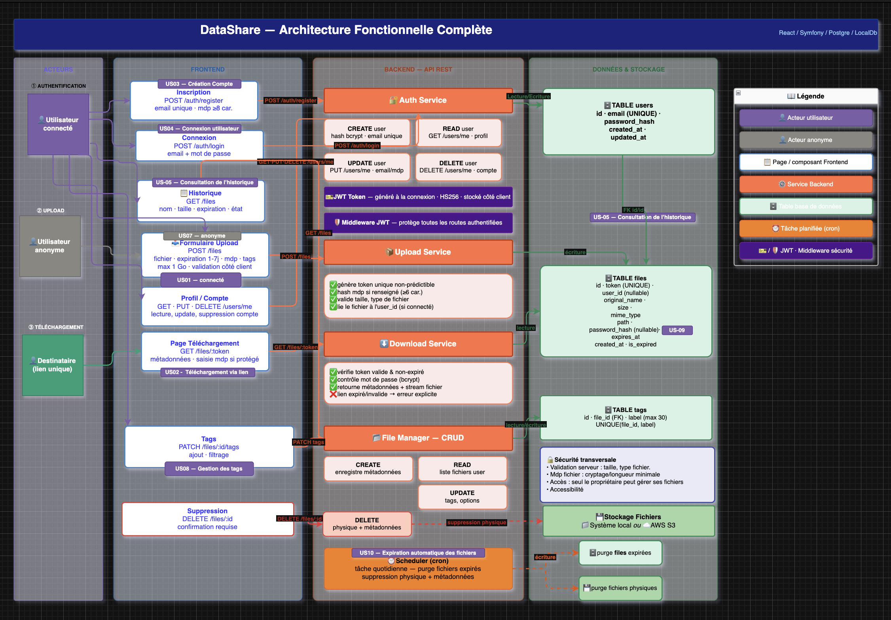

- Front React ↔ API Symfony (HTTP/JSON) ↔ PostgreSQL
- Fichiers stockés à part, sur le disque du serveur
- En local : front sur le port 5173, API sur le port 8000, base sur le port 5433

---

# 3. Modèle de données (BDD)

```
app_user (1) ──── (0..N) file_metadata (1) ──── (0..N) tag
```

- **app_user** : compte utilisateur (email, mot de passe haché)
- **file_metadata** : un fichier déposé (token, nom, taille, expiration, mot de passe optionnel)
- **tag** : étiquette associée à un fichier

Un fichier peut être déposé **sans compte** (`owner_id` peut être vide).

---

# 3. API (back-end)

| Route | Description | Accès |
|---|---|---|
| `POST /auth/register` | Créer un compte | Public |
| `POST /auth/login` | Se connecter (renvoie un JWT) | Public |
| `POST /files` | Déposer un fichier | Public |
| `GET /files/{token}/info` | Infos d'un fichier | Public |
| `GET /files/{token}` | Télécharger un fichier | Public |
| `GET /files` | Mes fichiers | Connecté |
| `PATCH /files/{id}/tags` | Modifier les tags | Connecté |
| `DELETE /files/{id}` | Supprimer un fichier | Connecté |

---

# 4. Démonstration — Page d'accueil / connexion

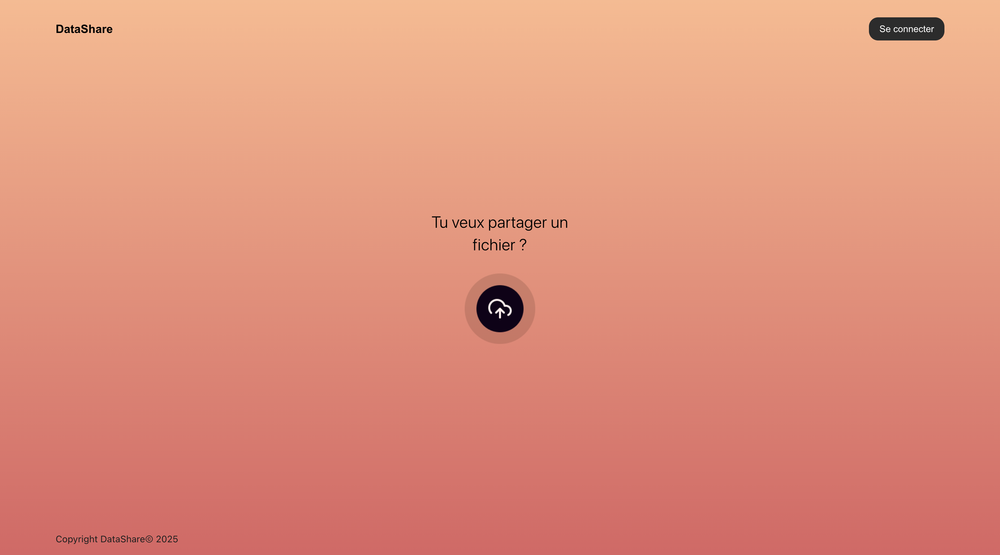

- Inscription et connexion via une modale
- Accès possible sans compte (upload anonyme)

---

# 4. Démonstration — Connexion / Inscription

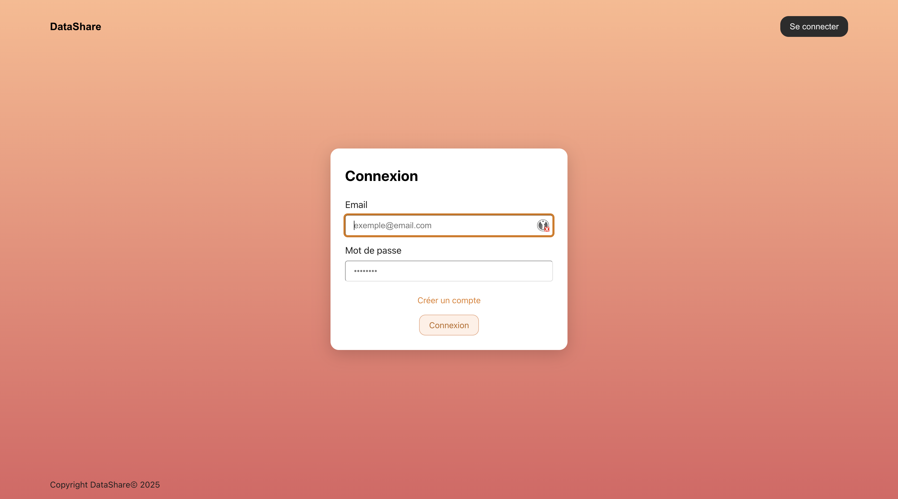 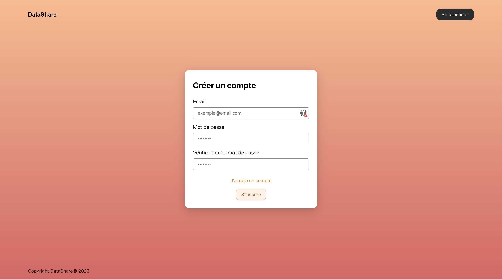

- Modale de connexion et modale d'inscription

---

# 4. Démonstration — Dépôt d'un fichier

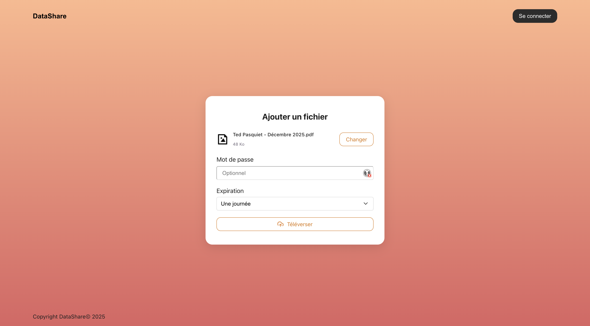 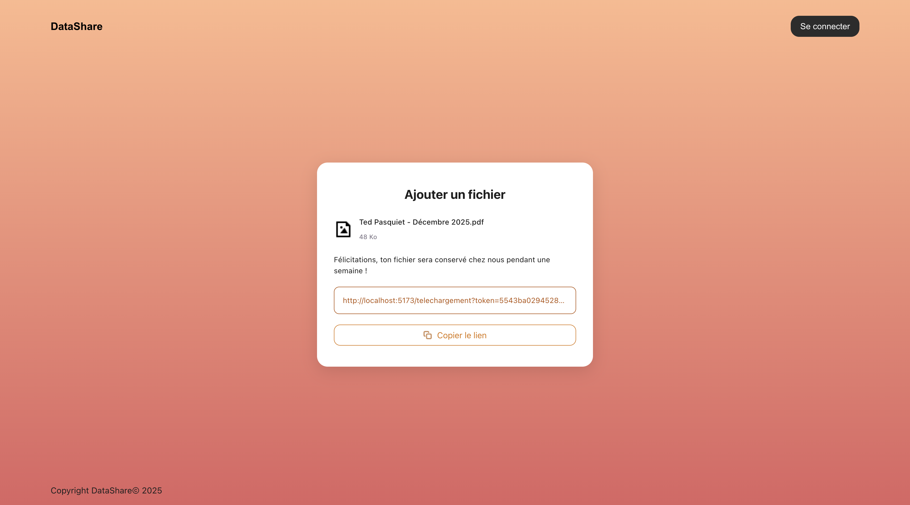

- Choix du fichier, de la durée de validité (1 à 7 jours)
- Mot de passe optionnel
- Ajout de tags
- Génération du lien de partage après l'envoi

---

# 4. Démonstration — Téléchargement

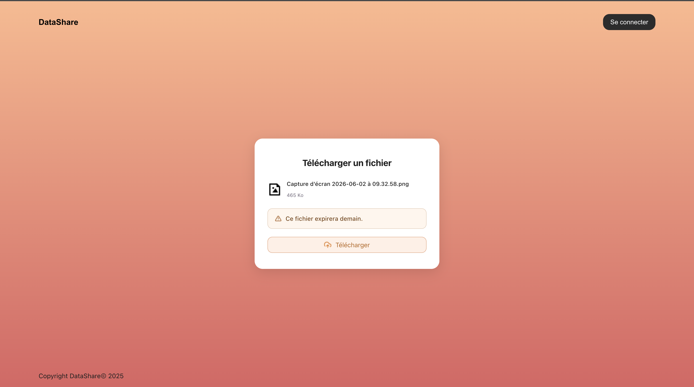

- Accès via le lien public (token)
- Si protégé : demande du mot de passe
- Affichage clair des informations (nom, taille, date d'expiration)

---

# 4. Démonstration — Gestion des erreurs

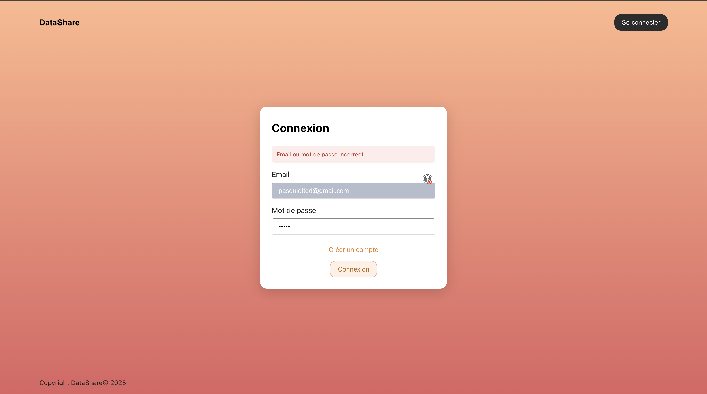 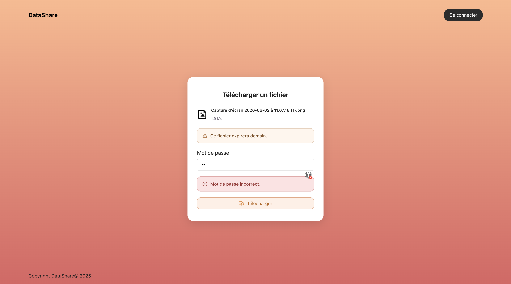

- Messages clairs si la connexion échoue
- Messages clairs si le mot de passe est incorrect
- Erreurs affichées directement dans l'interface (pas de page blanche)

---

# 4. Démonstration — Mon espace

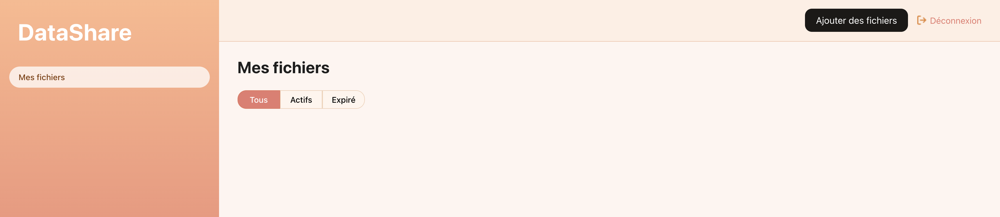

- Liste des fichiers déposés par l'utilisateur connecté
- Gestion des tags
- Suppression d'un fichier

---

# 4. Démonstration — Accessibilité

📸 **[Capture d'écran : mode contraste élevé activé]**

- Bouton de contraste élevé, préférence mémorisée
- Navigation au clavier (modales, focus géré)

---

# 5. Documentation

## README

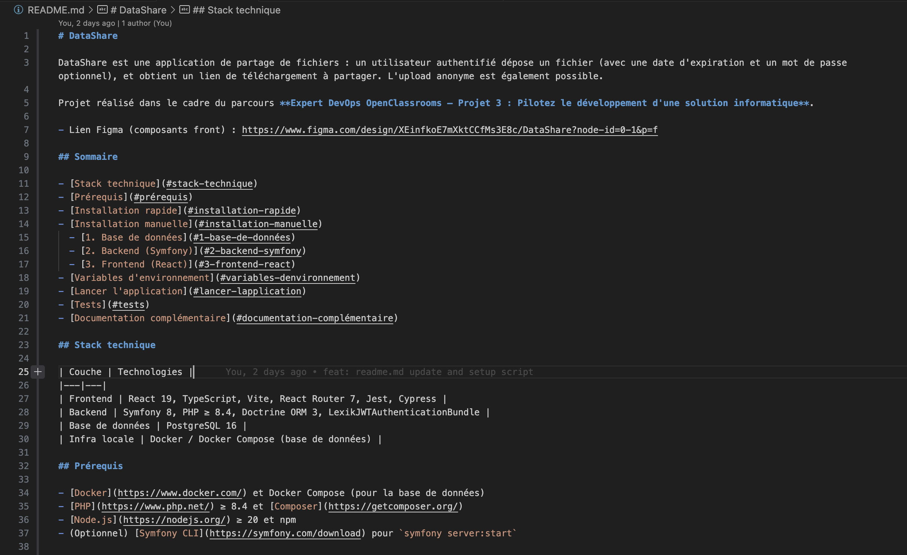

- Présentation du projet, stack technique
- Installation rapide (`./setup.sh`) et installation manuelle
- Commandes pour lancer les tests

---

# 5. Documentation

## Documentation d'API (OpenAPI)

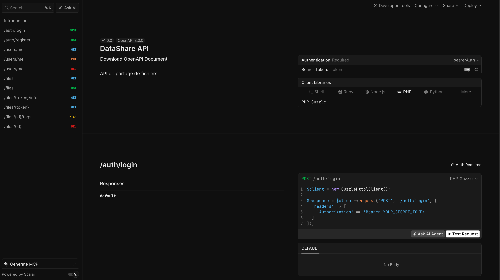

- Toutes les routes de l'API décrites (entrées, sorties, codes d'erreur)
- Collection Bruno pour tester chaque route manuellement

---

# 5. Documentation

## Documents complémentaires

- `SECURITY.md` : choix de sécurité et limites connues
- `TESTING.md` : stratégie et scénarios de tests
- `PERF.md` : tests de performance (k6)
- `MAINTENANCE.md` : procédure de mise à jour des dépendances

---

# 6. Pilotage et usage de l'IA (Claude Code)

## Ce que l'IA a fait

- Aide à l'écriture de code répétitif : pages, formulaires, contrôleurs, tests
- Aide à la rédaction d'une partie de la documentation

## Ce que j'ai gardé en main

- Les choix d'architecture et de technologies
- La relecture et la correction de tout le code généré
- La validation finale : tests, lint, build, avant chaque livraison

---

# Merci

Questions ?
